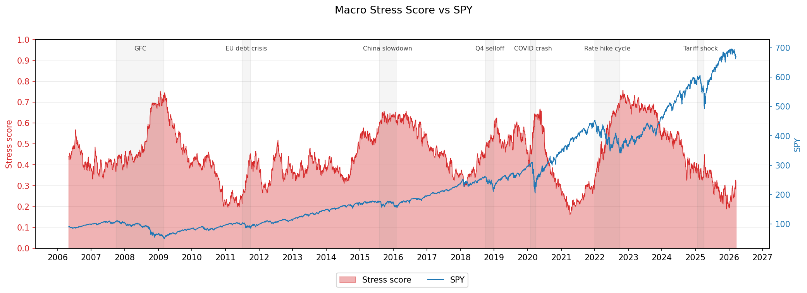
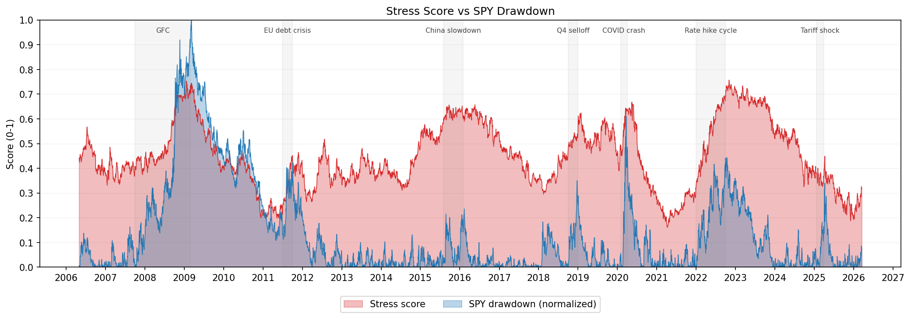
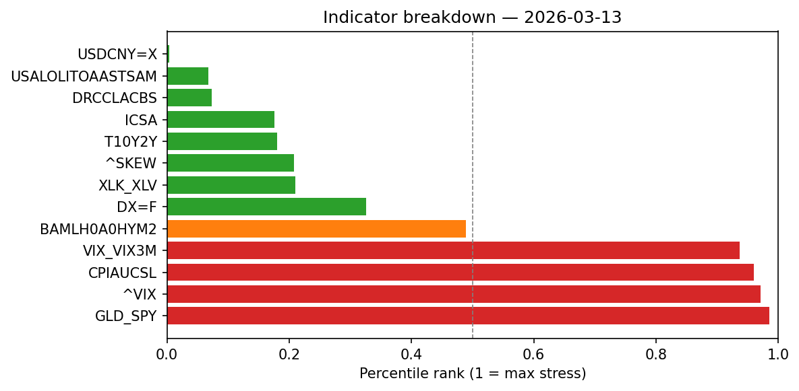
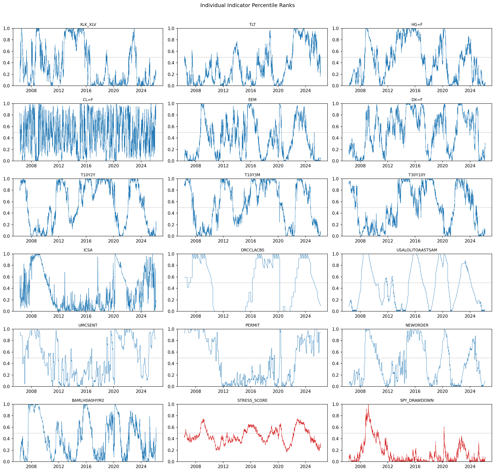

# macro-stress-pipeline

A data pipeline that ingests macro and market data, computes a composite financial stress score, and writes the result to parquet for downstream analysis.

The score is a rolling percentile rank (3-year window) averaged across 13 indicators, normalized so that **1.0 = maximum stress**. It is descriptive, not predictive — useful for contextualizing market conditions against historical stress levels.

## Indicators

**Market (yfinance)**
| Ticker | Indicator |
|---|---|
| `^VIX` | VIX |
| `^VIX` / `^VIX3M` | Near-term fear ratio |
| `^SKEW` | Tail risk demand |
| `GLD` / `SPY` | Risk-off ratio |
| `DX=F` | DXY dollar index |
| `USDCNY=X` | USD/CNY |
| `XLK` / `XLV` | Tech vs defensive rotation |

**Macro (FRED)**
| Series | Indicator |
|---|---|
| `T10Y2Y` | Yield curve spread (10Y–2Y) |
| `ICSA` | Initial jobless claims |
| `CPIAUCSL` | CPI |
| `DRCCLACBS` | Credit card delinquency rate |
| `USALOLITOAASTSAM` | OECD Leading Indicators |
| `BAMLH0A0HYM2` | ICE BofA HY OAS spread |

## Setup

Requires [uv](https://docs.astral.sh/uv/).

```bash
git clone https://github.com/your-username/macro-stress-pipeline.git
cd macro-stress-pipeline
uv sync
```

FRED requires a free API key. Create a `.env` file in the project root:

```
FRED_API_KEY=your_key_here
```

Get a key at [fred.stlouisfed.org](https://fred.stlouisfed.org/docs/api/api_key.html).

## Usage

```bash
uv run main.py
```

Outputs:
- `data/raw/market_raw.csv` — raw yfinance closes
- `data/raw/fred_raw.csv` — raw FRED series
- `data/processed/stress_score.parquet` — scored output with all ranked indicators and SPY

## Analysis

`notebooks/analysis.ipynb` visualizes the pipeline output. Run the pipeline first to generate `data/processed/stress_score.parquet`, then open the notebook in Jupyter or VS Code and run all cells.

**Stress score vs SPY**



**Stress score vs SPY drawdown (normalized)**



**Indicator breakdown — most recent observation**



**Individual indicator time series**



## Development

```bash
uv run pytest          # run tests
uv run ruff check .    # lint
uv run ruff format .   # format
```

## Architecture

```
fetch_data.py    →    process_data.py    →    features.py    →    pipeline.py
yfinance + FRED       merge, resample,        rolling pct rank,   orchestration,
                      compute ratios          composite score     parquet output
```
